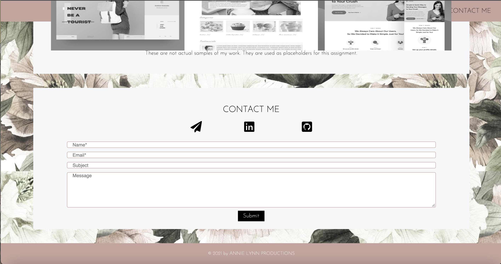

# 02 Advanced CSS: Portfolio

# Assignment Summary

The purpose of this assignment was to create a professional portfolio to introduce yourself and show your work. It required an about me section, a work section, and a contact section as well as specific componenets within those sections. I wanted a portfolio to reflect who I was and the things I like. I started with tmy favorite background image that is actually the same image as my desktop background. My favorite color is pink so I made the naviagtion bar and the footer pink. For the main body of the page, I kept the background of the sections white and chose colors that went with the background. I was aiming for a girly and simple design and I think I achieved that. After creating the navigation bar, I worked on the About Me section and then the Contact form secton- leaving the "My Work" section and footer to be completed last. The images used in the Work section are not mine and I will be replacing them with future applications.The icons in the Contact section will direct you accordingly, whether it's opening a new message to email me, or checking out my github or LinkedIn profile!

I enjoyed this assignment as it was a way for me to be creative! This project was time consuming and through trial and error, I was able to understand HTML and CSS better. I hope to improve this portfolio as I learn more in this program.

# Links
Here are my links and screenshots below: 
https://github.com/annielnguyen/ANguyen-Portfolio
https://annielnguyen.github.io/Portfolio/

